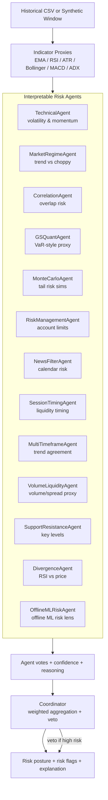

# Explainability Artifact (ATLAS)

This artifact shows how ATLAS turns offline data into an explainable
risk posture (GREENLIGHT / WATCH / STAND_DOWN).

## Flow diagram (Mermaid)

## Narrative trace (example)

**Scenario:** A synthetic stress window shows rising volatility and a shift from
calm to choppy price action.

**Trace:**
1. Indicators show elevated ATR (volatility proxy) and low ADX (choppy regime).
2. The TechnicalAgent flags HIGH_VOLATILITY; the MarketRegimeAgent flags
   REGIME_SHIFT; the MonteCarloAgent reports a high probability of large moves.
3. The coordinator aggregates scores and applies the safety veto rule.
4. Output: **STAND_DOWN** with risk flags
   `[HIGH_VOLATILITY, REGIME_SHIFT]` and a plain-language explanation.

**Why this matters:** Students see *why* the system is cautious and learn that
uncertainty is a valid reason to pause.
